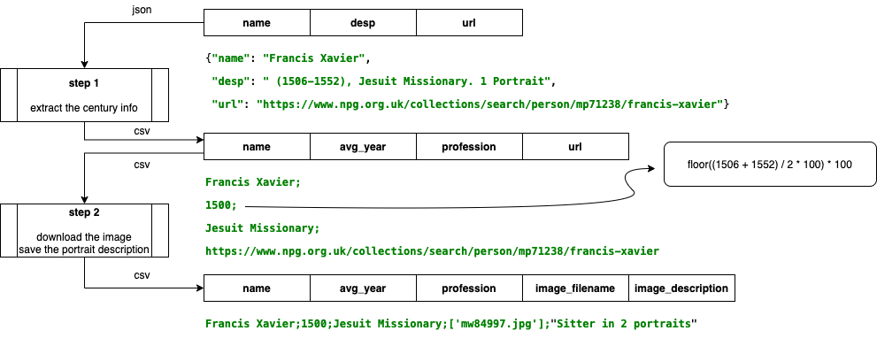

# Spiders

## Code

```
$ scrapy startproject spiders
$ cd spiders
$ scrapy genspider npg www.npg.org.uk
$ scrapy runspider --nolog npr.py
```

```
$ pip3 install selenium
$ brew cask install chromedriver
$ chromedriver --version
```

```
from selenium import webdriver

# initialize the driver
driver = webdriver.Chrome()

# open provided link in a browser window using the driver
driver.get("https://google.com")
```

## Steps

<p float="left">
	
</p>


## References
* https://scrapy.org/
* https://docs.scrapy.org/en/latest/topics/item-pipeline.html
* https://docs.scrapy.org/en/latest/topics/feed-exports.html#topics-feed-exports
* https://stackoverflow.com/questions/43922562/scrapy-how-to-use-items-in-spider-and-how-to-send-items-to-pipelines
* https://selenium-python.readthedocs.io/getting-started.html
